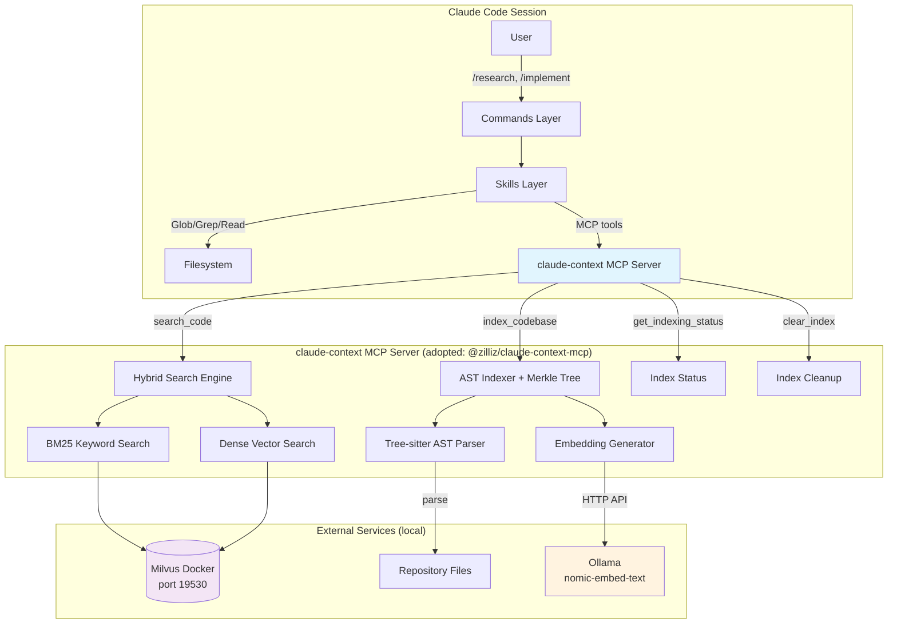

# Architecture: add-semantic-retrieval

## System Context Diagram



### Context in the Broader System

The retrieval layer is **additive** — it slots into the existing architecture as a new MCP server alongside Shannon. The workflow operates identically without it; when present, skills gain a `search_code` tool that returns semantically relevant code chunks before the agent begins manual Glob/Grep exploration.

```
EXISTING ARCHITECTURE                    NEW ADDITION
┌─────────────────────┐                 ┌──────────────────────────┐
│ User Interface      │                 │                          │
│  /sdlc, /research   │                 │                          │
└────────┬────────────┘                 │                          │
         │                              │                          │
┌────────▼────────────┐                 │  claude-context MCP      │
│ Orchestration Layer  │                 │  ┌──────────────────┐   │
│  SDLC Orchestrator   │                 │  │ search_code      │   │
└────────┬────────────┘                 │  │ index_codebase   │   │
         │                              │  │ get_indexing_status│  │
┌────────▼────────────┐  ◄── queries ── │  │ clear_index      │   │
│ Capabilities Layer   │                 │  └──────────────────┘   │
│  researching-code    │                 │           │              │
│  implementing-code   │                 │     ┌─────▼─────┐       │
│  planning-solutions  │                 │     │ Ollama    │       │
└────────┬────────────┘                 │     │ Milvus    │       │
         │                              │     └───────────┘       │
┌────────▼────────────┐                 └──────────────────────────┘
│ Security Layer       │
│  Shannon MCP         │
└─────────────────────┘
```

---

## Component Design

### Component 1: claude-context MCP Server (adopted, not built)

**Package:** `@zilliz/claude-context-mcp@0.1.6`
**Responsibility:** Indexing repositories and serving hybrid search queries over MCP protocol
**Runs as:** Child process of Claude Code, spawned via npx on session start

| Sub-component | Responsibility |
|---------------|----------------|
| AST Indexer | Tree-sitter parsing → code chunks at symbol boundaries (functions, classes, methods) |
| Merkle Tree | File hash tracking for incremental re-indexing (only changed files re-processed) |
| Embedding Generator | Calls Ollama API to generate dense vectors from code chunks |
| Hybrid Search | Combines BM25 keyword matching + dense vector similarity for ranked results |
| MCP Transport | stdio-based MCP protocol communication with Claude Code |

### Component 2: Ollama (external dependency, user-installed)

**Responsibility:** Local embedding model inference
**Model:** `nomic-embed-text` (768 dimensions, 8192 token context)
**Interface:** HTTP API on `http://127.0.0.1:11434`

### Component 3: Milvus (external dependency, Docker)

**Responsibility:** Vector + BM25 index storage and search
**Runs as:** Docker container on port 19530
**Storage:** Persistent volume mapped to host filesystem

### Component 4: Setup Wizard (new, to build)

**Location:** `.claude/commands/retrieval/setup.md`
**Responsibility:** Interactive setup guiding users through Ollama + Milvus + claude-context configuration
**Pattern:** Matches existing n8n/firecrawl setup wizards

### Component 5: Retrieval Command Handler (new, to build)

**Location:** `.claude/commands/retrieval.md`
**Responsibility:** `/retrieval` command for manual search, index management, and status checks
**Pattern:** Matches existing n8n.md/firecrawl.md command handlers

### Component 6: Skill Modifications (existing, to modify)

**Files modified:**
- `.claude/skills/researching-code/SKILL.md` — Add Step 0: semantic search before Glob/Grep
- `.claude/skills/implementing-code/SKILL.md` — Add optional retrieval for pattern discovery

---

## Data Model

### Index Structure (managed by Milvus)

```
Collection: code_chunks_{project_hash}
├── id: string (unique chunk identifier)
├── file_path: string (relative to project root)
├── language: string (detected language)
├── symbol_name: string (function/class/method name, if applicable)
├── symbol_type: string (function | class | method | module | unknown)
├── content: string (raw code chunk text)
├── start_line: int (line number in source file)
├── end_line: int (line number in source file)
├── embedding: float[768] (dense vector from nomic-embed-text)
├── bm25_content: string (tokenized text for BM25 index)
└── file_hash: string (for Merkle tree change detection)
```

### Merkle Tree (managed by claude-context internally)

```
project_root_hash
├── src/ → hash(children)
│   ├── auth/ → hash(children)
│   │   ├── middleware.ts → hash(file_content)
│   │   └── middleware.test.ts → hash(file_content)
│   └── api/ → hash(children)
└── lib/ → hash(children)
```

On re-index: compare root hash → walk changed subtrees → re-embed only changed files.

---

## API Design (MCP Tools)

### `search_code`

**Purpose:** Primary search interface — hybrid BM25 + vector similarity

```typescript
// Input
{
  path: string;              // Absolute path to indexed codebase
  query: string;             // Natural language search query
  limit?: number;            // Max results (default: 10)
  extensionFilter?: string[];// e.g., [".ts", ".py"]
}

// Output (array of ranked results)
[
  {
    filePath: string;        // "src/auth/middleware.ts"
    content: string;         // Code chunk text
    score: number;           // Relevance score (0-1)
    startLine: number;       // 42
    endLine: number;         // 87
    language: string;        // "typescript"
    symbolName?: string;     // "authenticateRequest"
  }
]
```

### `index_codebase`

**Purpose:** Build or incrementally update the search index

```typescript
// Input
{
  path: string;              // Absolute path to codebase
  ignorePatterns?: string[]; // ["node_modules/**", ".git/**"]
  force?: boolean;           // Force full re-index (default: false)
  splitter?: "ast" | "langchain"; // Chunking strategy (default: "ast")
  customExtensions?: string[];    // Additional file types
}

// Output
{
  status: "completed" | "already_indexed" | "in_progress";
  filesIndexed: number;
  chunksCreated: number;
  duration: string;          // "12.3s"
}
```

### `get_indexing_status`

```typescript
// Input
{ path: string; }

// Output
{
  indexed: boolean;
  progress?: number;         // 0-100 if in progress
  lastIndexed?: string;      // ISO timestamp
  fileCount?: number;
  chunkCount?: number;
}
```

### `clear_index`

```typescript
// Input
{ path: string; }

// Output
{ cleared: boolean; }
```

---

## State Management

### State Locations

| State | Location | Lifetime |
|-------|----------|----------|
| Milvus vector data | Docker volume `milvus-data` | Persistent across sessions |
| Merkle tree hashes | Managed by claude-context in Milvus metadata | Persistent |
| Ollama model weights | `~/.ollama/models/` | Persistent (user-managed) |
| MCP server process | Child of Claude Code | Session-scoped (restarts with Claude Code) |
| Index status | Queryable via `get_indexing_status` | Runtime |

### State Flow

```
Session Start
    │
    ├── Claude Code reads .claude/settings.json
    ├── Spawns claude-context MCP server (npx)
    ├── MCP server connects to Milvus (Docker) and Ollama
    │
    ├── User invokes /research
    │       ├── Skill calls search_code(path, query)
    │       │       ├── If not indexed → returns error message
    │       │       │       └── Skill suggests: "Run indexing first"
    │       │       └── If indexed → returns ranked results
    │       └── Skill continues with Glob/Grep (informed by results)
    │
    └── User invokes /retrieval index
            └── Calls index_codebase(path)
                    ├── Merkle tree check: unchanged? → skip
                    └── Changed files → re-chunk → re-embed → upsert
```

---

## Error Handling Strategy

| Error Scenario | Detection | Recovery | User Message |
|----------------|-----------|----------|--------------|
| Ollama not running | Connection refused on `localhost:11434` | Skill falls back to Glob/Grep only | "Ollama not detected. Retrieval disabled — using standard search. Run `ollama serve` to enable." |
| Milvus not running | Connection refused on `localhost:19530` | Skill falls back to Glob/Grep only | "Milvus not detected. Run `docker start milvus` or `/retrieval/setup`." |
| Model not pulled | Ollama 404 on model name | Prompt user to pull model | "Model `nomic-embed-text` not found. Run `ollama pull nomic-embed-text`." |
| Codebase not indexed | `search_code` returns "not indexed" | Auto-suggest indexing | "Codebase not indexed yet. Run `/retrieval index` to build the search index." |
| Index stale (files changed) | Merkle tree detects changes on next `index_codebase` | Incremental re-index | Silent — handled automatically |
| MCP server crash | Claude Code detects child process exit | Skills fall back to Glob/Grep | "Retrieval server unavailable. Continuing with standard search." |
| Embedding timeout | Ollama response > 5 min | Retry with smaller batch | "Embedding generation slow — reducing batch size and retrying." |

**Design principle:** Every failure mode degrades gracefully to the existing Glob/Grep workflow. Retrieval is always an enhancement, never a blocker.

---

## Performance Considerations

### Indexing Performance

| Codebase Size | Estimated Index Time | Strategy |
|---------------|---------------------|----------|
| Small (<500 files) | 30-60 seconds | Full index acceptable |
| Medium (500-5K files) | 2-5 minutes | Incremental via Merkle tree |
| Large (5K-50K files) | 10-30 minutes (first run) | Incremental critical; batch size tuning |

**Optimizations:**
- `EMBEDDING_BATCH_SIZE=5` for Ollama (prevents memory pressure)
- `OLLAMA_NUM_PARALLEL=1` (Ollama handles one request at a time on CPU)
- Merkle tree ensures subsequent runs only process changed files
- `CUSTOM_IGNORE_PATTERNS` excludes non-code directories upfront

### Search Performance

| Metric | Target | Mechanism |
|--------|--------|-----------|
| Query latency | < 500ms | Milvus HNSW index + BM25 |
| Results per query | 10 (default, configurable) | Limit parameter |
| Token savings | ~40% vs full directory loading | Chunk-level results, not whole files |

### Resource Usage

| Resource | Idle | During Indexing | During Search |
|----------|------|-----------------|---------------|
| Ollama RAM | ~1GB (model loaded) | ~1.5GB | ~1GB |
| Milvus RAM | ~200MB | ~500MB | ~300MB |
| Milvus Disk | 50-200MB per project | Growing | Stable |
| CPU | Minimal | High (embedding generation) | Low |

---

## Scalability Notes

### At 10x (50K files)

- Indexing: 30+ minutes first run; incremental keeps re-index < 2 min for typical changes
- Search: Milvus handles 50K collections well; latency stays < 500ms
- Storage: ~2GB Milvus disk per project
- **Action needed:** None — architecture handles this

### At 100x (500K files / monorepo)

- Indexing: First run could take hours; must be background process
- Search: Milvus scales, but may need dedicated resources
- Storage: ~20GB per project
- **Action needed:** Add background indexing with progress notifications; consider project-level index partitioning; may need Milvus cluster mode

### At multi-project scale

- Each project gets its own Milvus collection (keyed by project path hash)
- Single Milvus instance serves all projects
- Ollama model loaded once, shared across queries
- **Action needed:** None — already partitioned by collection
